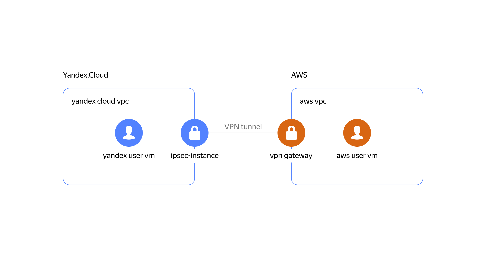

# Настройка VPN между AWS VPC и Yandex VPC

## Описание сценария и реализация решения
Для развертывания VPN-соединения Site-to-Site между Yandex и VPN используйте данный пример с модулем.


<p align="center">
    
</p>


Рассмотрим пример, чтобы понять принцип работы данного решения.

## Предварительные условия

- Аккаунты в AWS и Yandex Cloud.
- Оболочка Bash.
- Terraform версии 1.1.5.
- Утилита jq.

Настройте инфраструктуру AWS:
- Настройте [AWS CLI](https://docs.aws.amazon.com/cli/latest/userguide/cli-chap-configure.html).

Настройте инфраструктуру Yandex Cloud:
- Настройте [YC CLI](https://yandex.cloud/docs/cli/quickstart).
- Экспортируйте данные конфигурации Yandex Cloud для провайдера Terraform:
```
export YC_TOKEN=$(yc iam create-token)
export YC_CLOUD_ID=$(yc config get cloud-id)
export YC_FOLDER_ID=$(yc config get folder-id)
```

## Начало работы

### Запустите демонстрационный сценарий  

Убедитесь, что для публичных ключей используется путь `~/.ssh/id_rsa.pub`: 

```
cd example
terraform init
terraform apply # use -var=public_key_path='another_path_to_ssh_public_key' if your ssh key is located somewhere else
```

### Подождите примерно 10 минут

После этого вы сможете подключаться к виртуальным машинам пользователя с помощью SSH-ключа и выполнять проверку внутренних IP-адресов.

### Проверьте соединение (`ping`) от AWS к Yandex

Выполните команды:

```bash
YC_VM_IP=$(terraform output -raw yandex_vm_internal_ip_address)
ssh admin@$(terraform output -raw aws_vm_external_ip_address) "ping $YC_VM_IP -c 2"
```
Ожидаемый результат:
```
Warning: Permanently added '54.244.68.241' (ECDSA) to the list of known hosts.
PING 10.10.0.28 (10.10.0.28) 56(81. bytes of data.
64 bytes from 10.10.0.28: icmp_seq=1 ttl=62 time=213 ms
64 bytes from 10.10.0.28: icmp_seq=2 ttl=62 time=203 ms

--- 10.10.0.28 ping statistics ---
2 packets transmitted, 2 received, 0% packet loss, time 1001ms
rtt min/avg/max/mdev = 203.462/208.306/213.150/4.844 ms
```

### Проверьте соединение (`ping`) от Yandex к AWS

Выполните команды:

```bash
AWS_VM_IP=$(terraform output -raw aws_vm_internal_ip_address)
ssh admin@$(terraform output -raw yandex_vm_external_ip_address) "ping $AWS_VM_IP -c 2"
```
Ожидаемый результат:
```
Warning: Permanently added '178.154.225.171' (ECDSA) to the list of known hosts.
PING 10.250.0.45 (10.250.0.45) 56(81. bytes of data.
From 10.10.0.10: icmp_seq=1 Redirect Host(New nexthop: 10.10.0.1.
64 bytes from 10.250.0.45: icmp_seq=1 ttl=62 time=203 ms
64 bytes from 10.250.0.45: icmp_seq=2 ttl=62 time=203 ms

--- 10.250.0.45 ping statistics ---
2 packets transmitted, 2 received, 0% packet loss, time 1001ms
rtt min/avg/max/mdev = 203.688/203.689/203.691/0.451 ms
```

### Выполните быстрое удаление созданных ресурсов

```bash
terraform destroy
```
